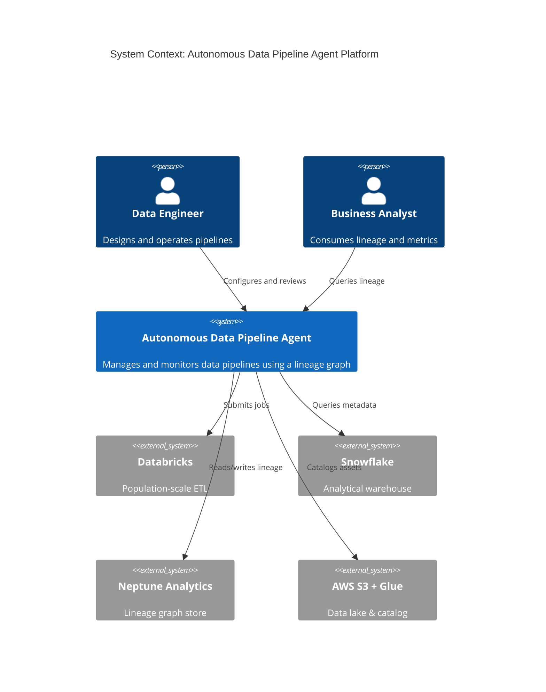
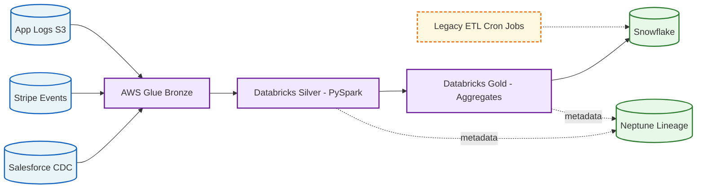
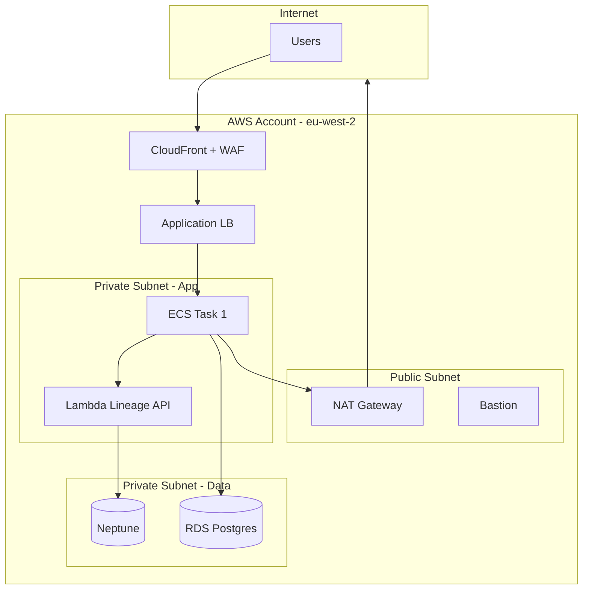
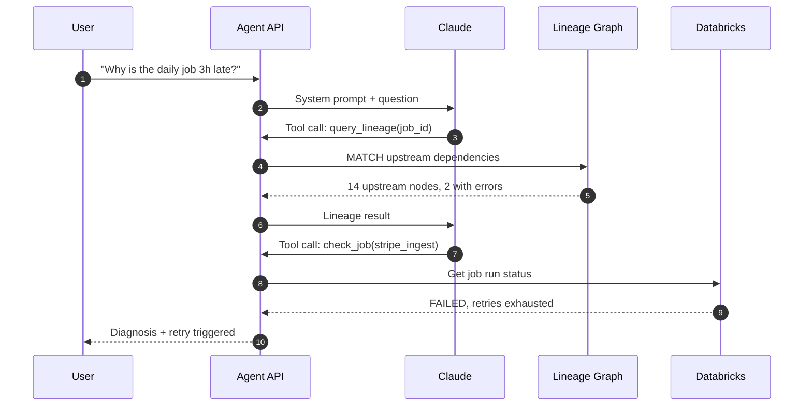
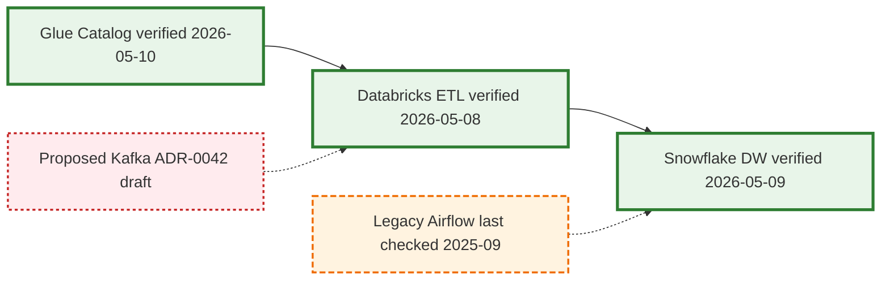

If you have ever opened a [Confluence](https://www.atlassian.com/software/confluence) page from two years ago and wondered whether the architecture it shows is still real, you have already met the problem this post is trying to fix. Hand-drawn diagrams in [Lucidchart](https://www.lucidchart.com/), [Visio](https://www.microsoft.com/en-gb/microsoft-365/visio/flowchart-software), [draw.io](https://www.drawio.com/) or PowerPoint share three failure modes that no amount of governance ever quite eliminates. They live somewhere your code does not, so nobody updates them in the same PR that changes the system. They cannot be diffed, reviewed, or merged. And they rot silently, because there is no compiler error for "this picture is now a lie."

Diagrams as code is the discipline that closes all three gaps. You write a small text file ( `.d2`, `.mmd`, `.puml`, or a Python script ), commit it next to the code it describes, render it in CI, and treat the rendered image as a build artefact. The text is the source of truth and the picture is the output. Everything else in this post is in service of making that loop work in production.

This is the version of the playbook I would hand to a senior data engineer who has been asked to "fix our architecture docs" and wants a concrete starting point rather than a tool review.

## Pick the tool by job, not by taste

There is no single best tool. Pick by the question you are trying to answer.

| Tool | Best for | Output | Renders in GitHub? |
|---|---|---|---|
| **[Mermaid](https://mermaid.js.org/)** | Embedded docs, README diagrams, sequence and flow and ER diagrams | SVG, PNG | Native |
| **[D2](https://d2lang.com/)** | Aesthetically polished architecture diagrams | SVG, PNG, PDF | No, render in CI |
| **[Python `diagrams`](https://diagrams.mingrammer.com/)** | Cloud architecture with real AWS, GCP and Azure icons | PNG, SVG | No, render in CI |
| **[PlantUML](https://plantuml.com/)** | UML, sequence, ER, deployment | SVG, PNG | Via proxy |
| **[Structurizr DSL](https://structurizr.com/) / [Likec4](https://likec4.dev/)** | C4 model with multiple synchronised views | SVG, PNG, JSON | No |
| **[Graphviz](https://graphviz.org/) / DOT** | Algorithmically generated graphs and lineage | SVG, PNG, PDF | No |
| **[Excalidraw](https://excalidraw.com/) + excalidraw-cli** | Sketchy whiteboard-style diagrams | PNG, SVG | No |

If you only learn one of these, learn Mermaid. It renders directly in GitHub, GitLab, Bitbucket, Notion and Obsidian, which means a diagram you write today is readable wherever the team already reads code. If you want diagrams that look like a designer touched them, learn D2. For AWS-heavy architecture decks with proper provider icons, Python `diagrams` is unbeatable.

## Match the diagram to the question

A surprising amount of poor technical communication comes from reaching for "an architecture diagram" when the audience actually wants a different view. The [C4 model](https://c4model.com/) and a small set of canonical diagram types cover almost every real need.

| You want to communicate... | Use a... |
|---|---|
| How the system fits in the wider world | C4 Context diagram |
| The major building blocks inside the system | C4 Container diagram |
| The runtime interaction between components for one scenario | Sequence diagram |
| Data movement and transformation stages | ETL / data flow diagram (DAG) |
| Network topology, subnets, security boundaries | Network / deployment diagram |
| State transitions of an entity | State diagram |
| Decision logic in a process | Flowchart |
| Entity relationships in a database | ER diagram |
| Time-bound delivery plan | Gantt chart |
| Lineage and dependencies | DAG, usually auto-generated |

Pick one. If the diagram is trying to answer two questions at once, the diagram is wrong and the fix is to split it.

## Worked examples

The five examples below are rendered Mermaid. The same patterns transfer to D2 and PlantUML with minor syntax changes.

### 1. C4 Context

This is the top-level "what is this system and who touches it" view. It should fit on one page and contain no implementation detail. If your context diagram has database names on it, it is not a context diagram.




### 2. ETL pipeline / data flow

The convention for data flow is left-to-right, sources on the left, sinks on the right, transformations in the middle. Labelling the [medallion layers](https://www.databricks.com/glossary/medallion-architecture) ( bronze, silver, gold ) makes the intent of each stage explicit and short-circuits the inevitable "what does this box do" review comment.

Notice the dashed orange box. That is a legacy job we know is still running but plan to retire. Encoding confidence visually saves a thousand wiki comments. More on this convention below.




### 3. Network / deployment

Networks need explicit boundaries: VPC, subnet, account, region. Mermaid subgraphs map cleanly to these. Always label which subnets are public and which are private, because that is almost always the actual question the reviewer is trying to answer.




### 4. Sequence diagram for an AI agent

Sequence diagrams are the right tool when the question is "what happens, in what order, between which actors." For AI agent flows specifically they are invaluable, because they make tool-use loops visible in a way that prose never quite does.




### 5. Confidence-coded diagram

This is the technique most teams skip and most often need. Colour and stroke style encode how much you trust each component to be current. A diagram that is honest about its own confidence is far more useful than one that pretends every box was verified yesterday.




The visual convention I would suggest is simple. Solid green is verified within the review window, dashed orange is stale or being retired, dashed red is proposed and not yet built. Reviewers see the diagram's own self-assessment at a glance and can immediately tell which parts to trust.

## A D2 example for comparison

For the same pipeline, here is roughly the same diagram in D2. D2's strengths are aesthetics, real cloud provider icons (Terrastruct hosts the AWS, GCP and Azure SVGs as URLs you can reference directly), and proper container nesting.

```d2
direction: right

vars: {
  d2-config: {
    layout-engine: elk
    theme-id: 200
  }
}

classes: {
  verified: { style.stroke: "#2E7D32"; style.stroke-width: 3 }
  stale:    { style.stroke: "#EF6C00"; style.stroke-dash: 4 }
}

sources: Sources {
  salesforce: Salesforce CDC { shape: cylinder }
  stripe: Stripe Events { shape: cylinder }
  logs: App Logs S3 {
    icon: https://icons.terrastruct.com/aws%2FStorage%2FAmazon-Simple-Storage-Service-S3.svg
    shape: image
  }
}

bronze: AWS Glue Bronze {
  icon: https://icons.terrastruct.com/aws%2FAnalytics%2FAWS-Glue.svg
  shape: image
}

silver: Databricks Silver { class: verified }
gold:   Databricks Gold   { class: verified }

snowflake: Snowflake { shape: cylinder; class: verified }
neptune:   Neptune Lineage {
  icon: https://icons.terrastruct.com/aws%2FDatabase%2FAmazon-Neptune.svg
  shape: image
}

legacy: Legacy ETL Cron { class: stale }

sources.salesforce -> bronze
sources.stripe     -> bronze
sources.logs       -> bronze
bronze -> silver -> gold -> snowflake
silver -> neptune: metadata
gold   -> neptune: metadata
legacy -> snowflake: scheduled (deprecated)
```

Render with:

```bash
d2 --layout=elk pipeline.d2 pipeline.svg
d2 --layout=elk pipeline.d2 pipeline.png
```

## A Python `diagrams` example

For AWS-heavy architecture decks, nothing beats real provider icons. Python `diagrams` uses Graphviz under the hood and lets you express infrastructure in code that is also readable by anyone who has used [PyTorch](https://pytorch.org/) or [Airflow](https://airflow.apache.org/).

```python
from diagrams import Diagram, Cluster, Edge
from diagrams.aws.compute import Lambda, ECS
from diagrams.aws.database import Neptune
from diagrams.aws.storage import S3
from diagrams.aws.analytics import Glue
from diagrams.aws.network import CloudFront, ELB
from diagrams.onprem.analytics import Databricks
from diagrams.saas.analytics import Snowflake

with Diagram("Lineage Platform", filename="lineage_platform", show=False, direction="LR"):
    cdn = CloudFront("CDN + WAF")
    with Cluster("VPC - eu-west-2"):
        with Cluster("App Tier"):
            api = ECS("Agent API")
            lin = Lambda("Lineage API")
        with Cluster("Data Tier"):
            graph = Neptune("Lineage Graph")
            lake = S3("Data Lake")
    glue = Glue("Glue Catalog")
    spark = Databricks("Databricks")
    dw = Snowflake("Snowflake")

    cdn >> api >> lin >> graph
    api >> lake
    spark >> Edge(label="writes") >> lake
    spark >> Edge(label="aggregates") >> dw
    glue >> Edge(style="dashed", label="catalogs") >> lake
```

`python diagram.py` produces `lineage_platform.png`. Commit both.

## Versioning and source-of-truth conventions

A diagram you cannot trust is worse than no diagram, because it actively misleads. The conventions below are what make trust explicit rather than implicit.

### File layout

```
your-repo/
├── docs/
│   └── diagrams/
│       ├── README.md                      # index of all diagrams
│       ├── platform-context.d2            # C4 context (top-level)
│       ├── platform-context.svg           # rendered
│       ├── ingest-pipeline.mmd
│       ├── ingest-pipeline.png
│       ├── network-prod.d2
│       └── adrs/
│           ├── 0001-use-neptune-for-lineage.md
│           └── 0042-evaluate-kafka.md
```

Co-locate diagrams with the code or infrastructure they describe. A central architecture repo full of orphaned diagrams will rot inside a quarter. A diagram in the same PR as the Terraform change it depicts will not.

### Metadata header

Every diagram file gets a header comment with provenance and a review date.

```
# ---
# diagram: ingest-pipeline
# version: 2.3.0
# last_verified: 2026-05-10
# verified_by: james.myddelton
# confidence: high
# review_cadence: quarterly
# next_review_due: 2026-08-10
# upstream_sources:
#   - terraform/data-platform/main.tf
#   - databricks/jobs/ingest_bronze.py
# adrs:
#   - docs/diagrams/adrs/0017-medallion-architecture.md
# ---
```

A short CI script can parse these headers and fail the PR if `next_review_due` is in the past, warn in PR comments if any `upstream_sources` file has changed since `last_verified`, and publish a freshness dashboard for the whole repo. None of this is exotic and all of it survives reorganisations.

### Confidence as a first-class concept

Adopt three states for components and edges. Verified means reviewed within the cadence and matching reality. Stale means the review window has expired and the component should be treated with caution. Proposed means it is referenced by an [ADR](https://adr.github.io/) but not yet built. Use the styling pattern from example 5. The diagram becomes self-describing about its own trustworthiness.

### Architecture Decision Records

A diagram shows the *what*. An ADR explains the *why*. Store ADRs next to diagrams as numbered markdown files (`0001-...md`, `0002-...md`) using a consistent template: context, decision, alternatives considered, consequences. Reference relevant ADRs from the diagram metadata header. The ADR set tends to become a more valuable artefact than the diagrams themselves, because it is the only record of the reasoning behind the boxes.

### Naming conventions

```
<system>-<view>-<level>.<ext>
```

Examples:

- `platform-context-c1.d2` for a C4 level 1 context
- `platform-container-c2.d2` for a C4 level 2 containers
- `ingest-pipeline-dataflow.mmd` for an ETL data flow
- `network-prod-eu-west-2.d2` for a network in one environment
- `agent-troubleshoot-sequence.mmd` for a sequence for one scenario

An audience suffix is optional but useful: `*-executive.d2`, `*-engineer.d2`. The diagram you present to a CFO is not the diagram you present to an SRE, and pretending it is leads to bad versions of both.

## CI/CD for diagrams

Treat `.d2`, `.mmd` and `.py` diagram files like any other source. Lint them, compile-check them, and render them in CI.

### Minimal GitHub Actions workflow

```yaml
name: Render diagrams
on:
  pull_request:
    paths: ['docs/diagrams/**']
  push:
    branches: [main]
    paths: ['docs/diagrams/**']

jobs:
  render:
    runs-on: ubuntu-latest
    steps:
      - uses: actions/checkout@v4

      - name: Install D2
        run: curl -fsSL https://d2lang.com/install.sh | sh -s --

      - name: Install Mermaid CLI
        run: npm install -g @mermaid-js/mermaid-cli

      - name: Render D2 files
        run: |
          for f in docs/diagrams/*.d2; do
            d2 --layout=elk --theme=200 "$f" "${f%.d2}.svg"
            d2 --layout=elk --theme=200 "$f" "${f%.d2}.png"
          done

      - name: Render Mermaid files
        run: |
          for f in docs/diagrams/*.mmd; do
            mmdc -i "$f" -o "${f%.mmd}.png" -b white
          done

      - name: Check freshness
        run: python scripts/check_diagram_freshness.py docs/diagrams

      - name: Commit rendered files
        if: github.event_name == 'push'
        run: |
          git config user.name "diagram-bot"
          git config user.email "bot@example.com"
          git add docs/diagrams/*.svg docs/diagrams/*.png
          git diff --staged --quiet || git commit -m "chore: re-render diagrams"
          git push
```

### Freshness check script

A short Python script that reads the metadata header and fails the PR if anything has slipped past its review date:

```python
# scripts/check_diagram_freshness.py
import re, sys, datetime
from pathlib import Path

stale = []
for f in Path(sys.argv[1]).glob("*.d2"):
    text = f.read_text()
    m = re.search(r"next_review_due:\s*(\d{4}-\d{2}-\d{2})", text)
    if m:
        due = datetime.date.fromisoformat(m.group(1))
        if due < datetime.date.today():
            stale.append((f.name, due))

if stale:
    print("Stale diagrams:")
    for name, due in stale:
        print(f"  {name}: review was due {due}")
    sys.exit(1)
```

## Generate diagrams from the system itself

This is the highest-leverage idea in the whole guide, and the one that defeats drift permanently. Hand-drawn diagrams describe the system as someone *remembers* it. Generated diagrams describe the system as it *is*. For high-churn areas, prefer generation every time.

### Where generation works well

| Source | Tool | Output |
|---|---|---|
| Terraform state | [`terraform graph`](https://developer.hashicorp.com/terraform/cli/commands/graph), [inframap](https://github.com/cycloidio/inframap), terramaid | Dependency graph |
| AWS account | [cloudmapper](https://github.com/duo-labs/cloudmapper) | VPC/network topology |
| Kubernetes cluster | [kubectl-graph](https://github.com/steveteuber/kubectl-graph) | Pod and service topology |
| [Snowflake](https://www.snowflake.com/) / [Databricks](https://www.databricks.com/) lineage | INFORMATION_SCHEMA, [Unity Catalog](https://www.databricks.com/product/unity-catalog) API | Data lineage DAG |
| [Airflow](https://airflow.apache.org/) / [Dagster](https://dagster.io/) / [Prefect](https://www.prefect.io/) DAGs | Native exports | Pipeline DAG |
| [dbt](https://www.getdbt.com/) project | `dbt docs generate` | Model lineage |
| [OpenAPI spec](https://www.openapis.org/) | openapi-to-plantuml | Sequence diagrams |

For a lineage platform built on a graph store like [Neptune](https://aws.amazon.com/neptune/), the diagrams are literally a view over the data. You can emit a `.d2` or `.mmd` file directly from a Cypher or openCypher query and re-render on every change. The diagram is then provably current by construction. That is a much stronger guarantee than "I checked it last quarter."

### Skeleton: lineage graph to Mermaid

```python
nodes = graph.query("MATCH (n:DataAsset) RETURN n.id, n.name, n.layer")
edges = graph.query("MATCH (a)-[r:FEEDS]->(b) RETURN a.id, b.id, r.type")

with open("docs/diagrams/lineage.mmd", "w") as f:
    f.write("flowchart LR\n")
    for nid, name, layer in nodes:
        cls = {"bronze":"compute","silver":"compute","gold":"store"}.get(layer,"")
        f.write(f'    {nid}["{name}"]:::{cls}\n')
    for src, tgt, typ in edges:
        arrow = "-.->" if typ == "scheduled" else "-->"
        f.write(f"    {src} {arrow} {tgt}\n")
```

Run on a schedule, nightly or on every catalog change, and commit the rendered output. The lineage diagram now updates itself, and the only way it can become wrong is if the underlying graph is wrong.

## Working with coding agents

LLMs are excellent at *authoring* diagram source. The render step is one shell command and the slow part is going from "I want a diagram of X" to syntactically correct `.d2` or `.mmd`. That is where coding agents save real time.

A practical workflow:

1. Describe what you want in plain English: components, connections, audience, level of detail.
2. Let the agent write the `.d2` or `.mmd` file and run the render command.
3. View the output, iterate by describing changes ("make Neptune a hexagon, dash the legacy edge").
4. Commit both source and rendered image.

Drop a section like this into your `CLAUDE.md` or `AGENTS.md` so the agent follows your conventions:

```markdown
## Diagram conventions
- All diagrams live in docs/diagrams/*.{d2,mmd} (source of truth).
- Render D2 with: d2 --layout=elk --theme=200 <file>.d2 <file>.svg
- Render Mermaid with: mmdc -i <file>.mmd -o <file>.png -b white
- Every file starts with a metadata header (version, last_verified, confidence, upstream_sources).
- Use class-based styling for confidence (verified / stale / proposed).
- Prefer ELK layout for D2; only use TALA if explicitly requested.
- Use Terrastruct AWS icon URLs for cloud components in D2.
- Commit both source and rendered SVG/PNG.
```

A small caveat: LLMs sometimes hallucinate syntax for newer language features, particularly D2 `vars`, `classes` and glob selectors, and the Mermaid v10+ changes. The CLI error messages are good and agents typically fix syntax issues in one turn. Worth pinning tool versions in CI either way.

## Best practices, compressed

### Do

- Pick the right diagram type for the question being asked. Not every diagram is "an architecture diagram."
- One diagram, one message. If you cannot summarise the diagram's purpose in a sentence, split it.
- Show direction. Data flows left-to-right or top-to-bottom by convention. Pick one and stick with it.
- Label edges, especially when the edge means something specific (HTTPS, async event, nightly batch).
- Use subgraphs for boundaries: accounts, VPCs, trust zones, teams.
- Encode confidence visually. Solid is verified, dashed is stale or proposed.
- Co-locate diagrams with code. Same repo, same PR, same review.
- Generate where you can, hand-draw where you must.
- Write an ADR for non-obvious decisions referenced by the diagram.

### Don't

- Do not put implementation detail in a context diagram. That is a different level of zoom.
- Do not mix logical and physical views in the same picture. Pick one.
- Do not render Visio or Lucidchart and embed as images unless you also commit the source. You will regret it.
- Do not draw a diagram you cannot explain in thirty seconds. Simplify or split.
- Do not bury text in tiny labels. If you would squint, your reviewer will too.
- Do not let any single diagram exceed twenty-five to thirty components. Past that point viewers lose the plot. Use hierarchical containers or split it.

## Recommended starter kit

If you are setting up diagrams as code from scratch this week:

1. Install Mermaid CLI (`npm i -g @mermaid-js/mermaid-cli`) and D2 (`brew install d2` or the install script).
2. Create `docs/diagrams/` in your main repo and add a `README.md` index.
3. Write your first three diagrams: a C4 context, an ETL data flow, and a network or deployment diagram. The templates above are good starting points.
4. Add the GitHub Actions workflow above to render in CI.
5. Write ADR-0001 capturing your decision to adopt diagrams as code, with the conventions you have chosen.
6. Add the freshness check script and set a quarterly review cadence.
7. For high-churn areas like lineage and infrastructure, build a generator from the source system.

That is roughly a week of work and it pays back inside a quarter, mostly in PRs that no longer need a separate "and update the diagrams" follow-up.

## Closing thought

The point of diagrams as code is not the diagrams. It is the discipline. A diagram that lives next to the system, gets reviewed in the same PR, and renders automatically in CI is a diagram that survives. Everything else in this post, the headers, the confidence styling, the ADRs, the freshness checks, the generators, is in service of one outcome. When someone asks "is this still accurate?", you can answer yes with evidence.

Pick one diagram you currently maintain in Lucidchart or Confluence. Convert it. Put it in your repo. Render it in CI. Then do the next one.

## Related Reading

- [The Modern Lakehouse Stack](/data-engineering/modern-lakehouse-stack/)
- [The Catalog Layer Is the New Battleground](/data-engineering/the-catalog-layer-is-the-new-battleground/)
- [Data Contracts in Production](/data-engineering/data-contracts-in-production/)
- [AI-Native Pipelines](/data-engineering/ai-native-pipelines/)
- [Unity Catalog in Practice](/data-engineering/unity-catalog-in-practice/)
